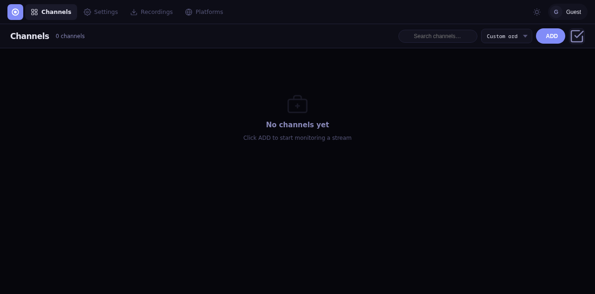
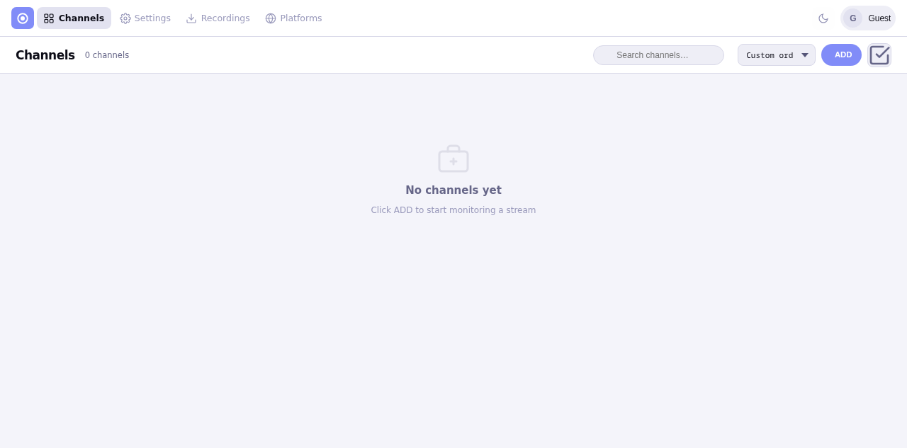
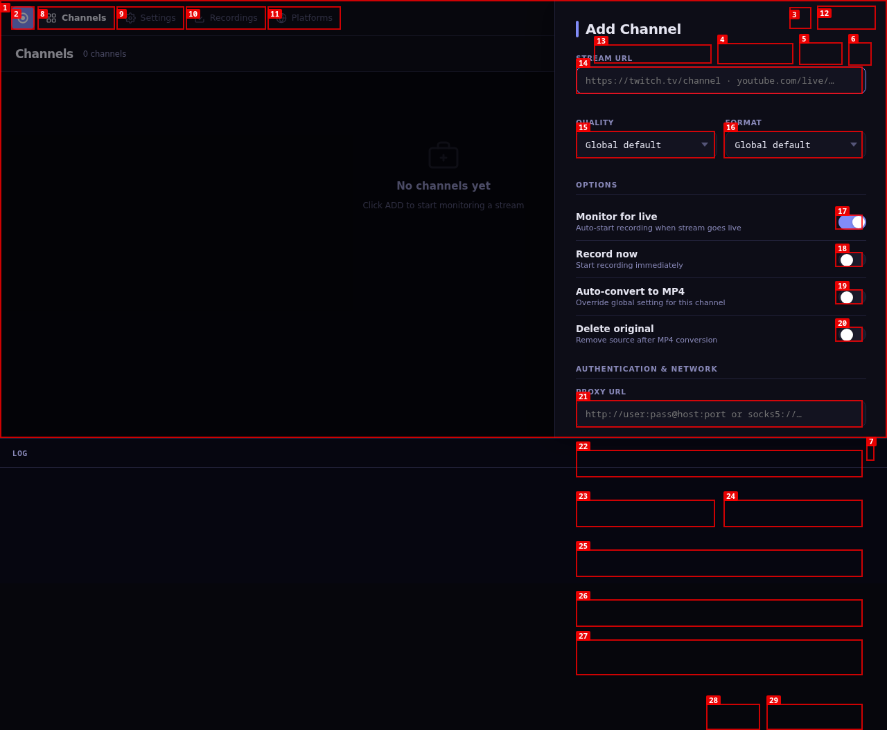
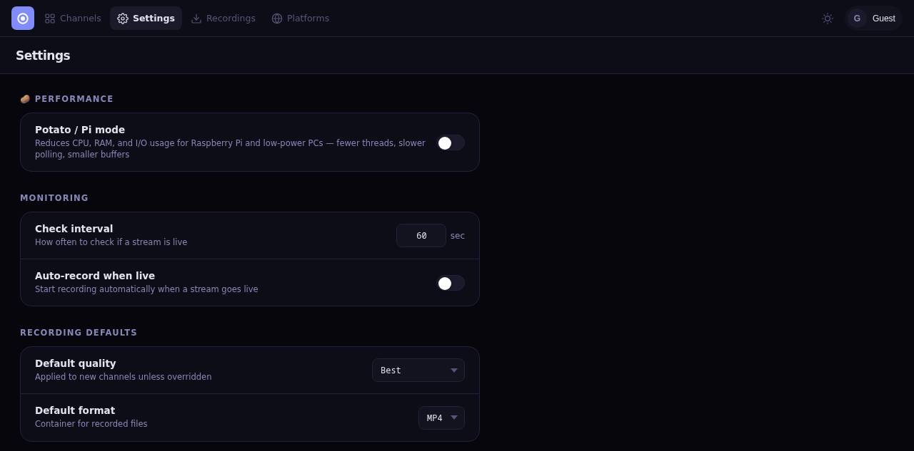
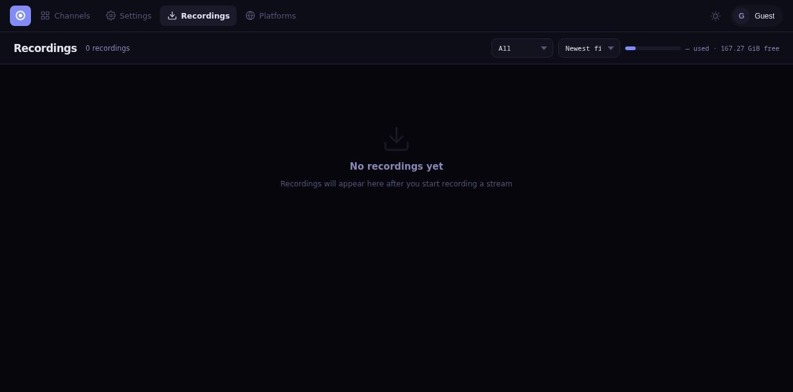
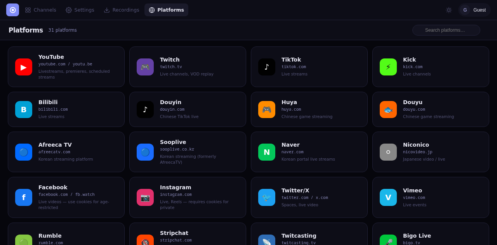

     1|<p align="center">
     2|  
     3|  
     4|  
     5|  
     6|  
     7|  
     8|</p>
     9|
    10|<h1 align="center">🔴 StreamRec</h1>
    11|
    12|<p align="center">
    13|  <strong>Self-hosted live stream recorder with a beautiful web UI.</strong><br>
    14|  Automatically monitor and record live streams from 30+ platforms — all from a single dashboard.
    15|</p>
    16|
    17|<p align="center">
    18|  
    19|</p>
    20|
    21|---
    22|
    23|## 📑 Table of Contents
    24|
    25|- [Features](#-features)
    26|- [Screenshots](#-screenshots)
    27|- [Getting Started](#-getting-started)
    28|- [Updating](#-updating)
    29|- [VPN / Proxy Setup](#-vpn--proxy-setup)
    30|- [Cookies / Age-Restricted Streams](#-cookies--age-restricted-streams)
    31|- [Configuration](#-configuration)
    32|- [Architecture](#️-architecture)
    33|- [Project Structure](#-project-structure)
    34|- [API Reference](#-api-reference)
    35|- [Raspberry Pi / Low-Power Devices](#-raspberry-pi--low-power-devices)
    36|- [Troubleshooting](#-troubleshooting)
    37|- [Contributing](#-contributing)
    38|- [License](#-license)
    39|
    40|---
    41|
    42|## ✨ Features
    43|
    44|### 🌍 Multi-Platform Support
    45|Record live streams from **30+ platforms** including:
    46|
    47|| Platform | Platform | Platform | Platform |
    48||----------|----------|----------|----------|
    49|| YouTube | Twitch | TikTok | Kick |
    50|| Bilibili | Instagram | Facebook | Twitter/X |
    51|| Rumble | Vimeo | Dailymotion | Niconico |
    52|| Douyin | Huya | Douyu | Afreeca |
    53|| Sooplive | Naver | Weibo | Bigo |
    54|| Twitcasting | Pandalive | Stripchat | Chaturbate |
    55|| Cam4 | MyFreeCams | BongaCams | CamSoda |
    56|| CamModels | Streamate | Flirt4Free | _…and more via yt-dlp_ |
    57|
    58|### 🎯 Core Capabilities
    59|- **Automatic Live Detection** — Periodically checks if a channel is live and starts recording automatically
    60|- **Multi-Channel Monitoring** — Monitor dozens of channels simultaneously from a single dashboard
    61|- **One-Click Recording** — Manually start/stop recordings at any time
    62|- **Quality Selection** — Choose from Best, 1080p, 720p, 480p, or Lowest quality per channel
    63|- **Multiple Formats** — Record in MP4, MKV, or TS container formats
    64|- **Live-from-Start** — Captures the stream from the very beginning (on supported platforms)
    65|- **Bulk Actions** — Multi-select channels and record, stop, delete, or edit quality/format in bulk
    66|- **Channel Reordering** — Drag-and-drop to organize your channel list
    67|- **Per-Channel Notes** — Add private notes to each channel for context
    68|- **Stream Title Tracking** — See what the streamer is currently broadcasting
    69|
    70|### 📡 Smart Recording
    71|- **Auto-Retry on Disconnect** — Automatically reconnects when a stream drops, with configurable retry count and delay
    72|- **Post-Processing** — Optionally auto-convert recordings to MP4 after completion (lossless remux)
    73|- **Container Fix** — Automatically remuxes interrupted recordings to fix broken containers
    74|- **Progress Tracking** — Real-time file size, download speed, and duration displayed per recording
    75|- **Max Duration Enforcement** — Set a per-channel or global time limit; recordings auto-stop gracefully when reached
    76|- **Recording Retention** — Auto-delete recordings older than N days to manage disk space (0 = keep forever)
    77|- **Stalled Detection** — Warns (or auto-stops) when a stream stops sending data silently
    78|- **Webhook Notifications** — POST JSON to any HTTP endpoint when streams go live or recordings complete
    79|- **Archive & Restore** — Move completed recordings to an archive folder and restore them later
    80|
    81|### 🖥️ Beautiful Web Interface
    82|- **Dark & Light Themes** — Toggle between dark and light mode with one click
    83|- **Responsive Design** — Works on desktop, tablet, and mobile
    84|- **Search & Filter** — Quickly find channels by name, platform, notes, or stream title
    85|- **Sort Channels** — Order by name, platform, recently added, last checked, or live first
    86|- **Recordings Filter & Sort** — Filter by status and sort by date, size, or name
    87|- **In-Browser Preview** — Play back completed recordings directly in the browser
    88|- **Live Log Panel** — View real-time yt-dlp output from the channels or recordings page
    89|- **Disk Usage Stats** — Monitor your storage usage from the recordings page
    90|- **Concurrent Slot Indicator** — See how many recording slots are in use (e.g. 2/6)
    91|- **Keyboard Shortcuts** — Press `N` to add, `1-4` to navigate pages, `R/S/Del` for bulk actions
    92|
    93|### ⚙️ Configuration
    94|- **Per-Channel Overrides** — Set quality, format, proxy, and post-processing options individually per channel
    95|- **VPN / Proxy Support** — Route any channel through a proxy or WireGuard VPN (built-in wireproxy sidecar)
    96|- **Cookies / Credentials** — Record age-restricted streams using browser cookies or username/password
    97|- **Import / Export** — Back up and restore your channel list and settings as a JSON file
    98|- **Persistent State** — All channels, settings, and finished recordings survive container restarts
    99|- **Raspberry Pi Mode** — Built-in resource-constrained mode for low-power devices (`STREAMREC_PI_MODE=1`)
   100|
   101|### 👤 Local Account (optional)
   102|- **Personalize the dashboard** — Pick a username and a profile picture that shows in the top-right corner across every page
   103|- **Password-protected** — Stored with PBKDF2-HMAC-SHA256 (200k iterations) over a 32-byte random salt; the plaintext is never written to disk
   104|- **Skip anytime** — A **Skip for now** button on the welcome screen keeps the full dashboard usable without an account
   105|- **Account settings menu** — Edit username, change password (with current-password verification), swap or remove your profile picture, or delete the account entirely
   106|- **Private on-disk** — Account file (`account.json`) is `chmod 600` on Unix and lives inside the recordings volume, not in the exported config
   107|
   108|### 🛡️ Reliability
   109|- **Supervised monitor loop** — Per-channel live checks run in parallel and crash-isolated; one broken URL can't stall detection for the rest
   110|- **Graceful shutdown** — In-flight recordings are stopped cleanly and state is flushed when the server exits
   111|- **Proper concurrency caps** — Concurrent `yt-dlp` and `curl` subprocesses honour the process semaphore
   112|- **Per-channel recording lock** — Prevents accidental double-recording from concurrent calls
   113|- **Stalled recording detection** — Warns (or auto-stops) when a stream stops sending data silently
   114|- **Upload limits** — Cookies files capped at 5 MiB, profile pictures at 2 MiB
   115|- **PBKDF2 password hashing** — Account passwords hashed with 200k SHA256 iterations; plaintext never stored
   116|- **Atomic file writes** — State and account files written to `.tmp` then atomically renamed to prevent corruption
   117|
   118|---
   119|
   120|## 📸 Screenshots
   121|
   122|### 🌙 Dark Mode — Channels
   123|> The main dashboard showing all monitored channels with live status, recording controls, and real-time stats.
   124|
   125|
   126|
   127|### ☀️ Light Mode — Channels
   128|> The same channel dashboard in light theme — switch with one click.
   129|
   130|
   131|
   132|### ➕ Add Channel
   133|> Add any channel by pasting a URL — StreamRec auto-detects the platform and fetches metadata.
   134|
   135|
   136|
   137|### ⚙️ Settings
   138|> Configure global defaults, proxy, cookies, auto-retry behavior, and more.
   139|
   140|
   141|
   142|### 🎬 Recordings
   143|> Browse, preview, download, or delete completed recordings — all from the web UI.
   144|
   145|
   146|
   147|### 🌐 Platforms
   148|> View all 30+ supported streaming platforms at a glance.
   149|
   150|
   151|
   152|---
   153|
   154|## 🚀 Getting Started
   155|
   156|### Docker Compose (Recommended)
   157|
   158|1. **Clone the repository:**
   159|   ```bash
   160|   git clone https://github.com/orhogi/streamerREC.git
   161|   cd streamerREC
   162|   ```
   163|
   164|2. **Start the application:**
   165|   ```bash
   166|   docker compose up -d
   167|   ```
   168|
   169|3. **Open your browser:**
   170|   ```
   171|   http://localhost:8080
   172|   ```
   173|
   174|That's it! Your recordings will be saved in the `./recordings` directory.
   175|
   176|### Docker Run
   177|
   178|```bash
   179|docker build -t streamrec .
   180|docker run -d \
   181|  --name streamrec \
   182|  -p 8080:8080 \
   183|  -v ./recordings:/recordings \
   184|  --restart unless-stopped \
   185|  streamrec
   186|```
   187|
   188|### Manual Installation
   189|
   190|**Prerequisites:**
   191|- Python 3.12+
   192|- [FFmpeg](https://ffmpeg.org/download.html)
   193|- [yt-dlp](https://github.com/yt-dlp/yt-dlp#installation)
   194|
   195|```bash
   196|pip install -r requirements.txt
   197|mkdir -p recordings
   198|uvicorn main:app --host 0.0.0.0 --port 8080
   199|```
   200|
   201|---
   202|
   203|## 🔄 Updating
   204|
   205|### Docker
   206|
   207|```bash
   208|cd streamerREC
   209|git pull
   210|docker compose down
   211|docker compose build --no-cache
   212|docker compose up -d
   213|```
   214|
   215|Your channels, settings, and completed recordings are stored in `./recordings/state.json` and will persist across updates. If you created a local account, the hashed credentials live in `./recordings/account.json` and your profile picture in `./recordings/avatars/` — back these up alongside the rest of the recordings folder.
   216|
   217|### Manual
   218|
   219|```bash
   220|cd streamerREC
   221|git pull
   222|pip install -r requirements.txt --upgrade
   223|# Restart the server
   224|```
   225|
   226|---
   227|
   228|## 🔒 VPN / Proxy Setup
   229|
   230|StreamRec includes a built-in WireGuard proxy (wireproxy) that runs as a sidecar container. It exposes a SOCKS5 proxy at `socks5://wireproxy:1080` that you can assign to individual channels or globally.
   231|
   232|This is useful for:
   233|- Recording geo-blocked streams
   234|- Routing cam site traffic through a VPN
   235|- Bypassing IP bans on specific platforms
   236|
   237|### 1. Add your WireGuard config
   238|
   239|Place your WireGuard config file at `streamerREC/wg0.conf`:
   240|
   241|```ini
   242|[Interface]
   243|PrivateKey = <your private key>
   244|Address = 10.x.x.x/32
   245|DNS = 1.1.1.1
   246|
   247|[Peer]
   248|PublicKey = <server public key>
   249|Endpoint = <server>:<port>
   250|AllowedIPs = 0.0.0.0/0
   251|```
   252|
   253|> You can get a WireGuard config from any VPN provider (Mullvad, ProtonVPN, etc.) or your own server.
   254|
   255|### 2. Rebuild with the VPN config
   256|
   257|```bash
   258|docker compose down && docker compose build && docker compose up -d
   259|```
   260|
   261|### 3. Assign the proxy to a channel
   262|
   263|In the web UI:
   264|1. Open a channel's settings
   265|2. Set the **Proxy** field to:
   266|   ```
   267|   socks5://wireproxy:1080
   268|   ```
   269|3. Save
   270|
   271|That channel will now record and check live status through the VPN.
   272|
   273|### 4. Set a global proxy (optional)
   274|
   275|To route **all** channels through the VPN:
   276|1. Go to **Settings**
   277|2. Set the **Proxy** field to:
   278|   ```
   279|   socks5://wireproxy:1080
   280|   ```
   281|3. Save
   282|
   283|> The proxy is opt-in — channels without a proxy set go direct. Live detection also routes through the proxy, so geo-blocked channels are detected correctly.
   284|
   285|---
   286|
   287|## 🍪 Cookies / Age-Restricted Streams
   288|
   289|For platforms that require login (age-restricted content, private streams):
   290|
   291|1. Export your browser cookies using a browser extension (e.g. **Get cookies.txt LOCALLY**)
   292|2. Go to **Settings → Cookies** in the web UI and upload the file
   293|3. Assign the cookies file to the channel in its settings
   294|
   295|You can also set a username/password per channel for platforms that support it.
   296|
   297|### Webhook Event Payloads
   298|
   299|<details>
   300|<summary><strong><code>stream_live</code> — fired when a monitored stream goes live</strong></summary>
   301|
   302|```json
   303|{
   304|  "event": "stream_live",
   305|  "channel_id": "abc12345",
   306|  "name": "StreamerName",
   307|  "url": "https://twitch.tv/streamer",
   308|  "platform": "Twitch",
   309|  "recording_id": "def67890"
   310|}
   311|```
   312|</details>
   313|
   314|<details>
   315|<summary><strong><code>recording_complete</code> — fired when a recording finishes (success or error)</strong></summary>
   316|
   317|```json
   318|{
   319|  "event": "recording_complete",
   320|  "recording_id": "def67890",
   321|  "channel_id": "abc12345",
   322|  "status": "completed",
   323|  "filename": "StreamerName_2026-05-03_14-30-00.mp4",
   324|  "bytes": 150994944,
   325|  "error": "",
   326|  "platform": "Twitch"
   327|}
   328|```
   329|</details>
   330|
   331|---
   332|
   333|## 🧰 Configuration
   334|
   335|### Environment Variables
   336|
   337|| Variable | Default | Description |
   338||----------|---------|-------------|
   339|| `STREAMREC_PI_MODE` | `0` | Set to `1` to enable Raspberry Pi mode |
   340|| `RECORDINGS_DIR` | `~/StreamRec/recordings` | Override recordings directory |
   341|
   342|### Settings (via Web UI)
   343|
   344|| Setting | Default | Description |
   345||---------|---------|-------------|
   346|| Potato / Pi mode | Off | Reduce CPU/RAM/I/O for low-power devices |
   347|| Check Interval | 60s (120s Pi) | How often to check if channels are live |
   348|| Auto-record when live | Off | Start recording automatically when a stream goes live |
   349|| Default Quality | `best` | Default recording quality for new channels |
   350|| Default Format | `mp4` | Default container format |
   351|| Auto-convert to MP4 | Off | Remux completed recordings to MP4 |
   352|| Delete Original | Off | Remove source file after MP4 conversion |
   353|| Auto-Retry | On | Reconnect on unexpected disconnections |
   354|| Max Retries | 5 | Maximum reconnect attempts |
   355|| Retry Delay | 15s | Wait time between retries |
   356|| Proxy | — | Global proxy for all channels |
   357|| Extra yt-dlp args | — | Additional yt-dlp arguments applied globally |
   358|| Cookies File | — | Global cookies file for authentication |
   359|| Retention Days | 0 (keep forever) | Auto-delete recordings older than this |
   360|| Max Duration | 0 (no limit) | Auto-stop recordings after N minutes (global) |
   361|| Webhook URL | — | POST JSON on stream live & recording complete |
   362|| Auto-stop stalled | Off | Force-stop recordings that stop receiving data |
   363|
   364|---
   365|
   366|## 🏗️ Architecture
   367|
   368|```
   369|─────────────────────────────────────────────
   370|              Browser
   371|          (index.html – SPA)
   372|─────────────────┬───────────────────────────
   373|                 │ REST API
   374|─────────────────▼───────────────────────────
   375|            FastAPI Server
   376|             (main.py)
   377|
   378|  ┌────────────┐ ┌────────────┐ ┌─────────┐
   379|  │  Channel   │ │ Recording  │ │ Monitor │
   380|  │  Manager   │ │  Engine    │ │  Loop   │
   381|  └────────────┘ └─────┬──────┘ └─────────┘
   382|                       │
   383|                 ┌─────▼──────┐
   384|                 │  yt-dlp +  │
   385|                 │   FFmpeg   │
   386|                 └────────────┘
   387|─────────────────────────────────────────────
   388|                 │
   389|          ┌──────▼──────┐   ┌─────────────┐
   390|          │ /recordings │   │  wireproxy  │
   391|          │  (volume)   │   │ (WireGuard) │
   392|          └─────────────┘   └─────────────┘
   393|```
   394|
   395|- **Frontend:** Single-page HTML/CSS/JS (no build step)
   396|- **Backend:** Python FastAPI with async subprocess management
   397|- **Recording:** Powered by yt-dlp and FFmpeg
   398|- **State:** JSON file persisted to the recordings volume
   399|- **VPN:** Optional wireproxy sidecar (WireGuard → SOCKS5)
   400|
   401|---
   402|
   403|## 📁 Project Structure
   404|
   405|```
   406|streamerREC/
   407|├── main.py              # FastAPI backend — API routes, recording engine, monitor loop
   408|├── index.html           # Complete frontend — single-file SPA with embedded CSS/JS
   409|├── Dockerfile           # Container image definition
   410|├── Dockerfile.wireproxy # Wireproxy sidecar image
   411|├── docker-compose.yml   # Docker Compose service configuration
   412|├── requirements.txt     # Python dependencies
   413|├── screenshots/         # App screenshots used in README
   414|├── LICENSE              # MIT License
   415|└── README.md
   416|```
   417|
   418|---
   419|
   420|## 📖 API Reference
   421|
   422|<details>
   423|<summary><strong>Channels</strong></summary>
   424|
   425|| Method | Endpoint | Description |
   426||--------|----------|-------------|
   427|| `POST` | `/api/channels` | Add a new channel |
   428|| `GET` | `/api/channels` | List all channels |
   429|| `PATCH` | `/api/channels/{id}` | Update channel settings |
   430|| `DELETE` | `/api/channels/{id}` | Delete a channel |
   431|| `POST` | `/api/channels/{id}/record` | Start recording |
   432|| `POST` | `/api/channels/{id}/stop` | Stop recording (graceful) |
   433|| `POST` | `/api/channels/{id}/kill` | Force-stop recording |
   434|| `POST` | `/api/channels/{id}/refresh` | Refresh channel metadata |
   435|| `POST` | `/api/channels/reorder` | Reorder channel list |
   436|| `POST` | `/api/channels/bulk` | Bulk record/stop/delete |
   437|| `POST` | `/api/channels/bulk-edit` | Bulk edit quality/format |
   438|
   439|</details>
   440|
   441|<details>
   442|<summary><strong>Recordings</strong></summary>
   443|
   444|| Method | Endpoint | Description |
   445||--------|----------|-------------|
   446|| `GET` | `/api/recordings` | List all recordings |
   447|| `GET` | `/api/recordings/{id}/log` | Get recording log |
   448|| `GET` | `/api/download/{id}` | Download a recording |
   449|| `GET` | `/api/preview/{id}` | Stream/preview a recording |
   450|| `DELETE` | `/api/recordings/{id}` | Delete a recording |
   451|| `POST` | `/api/recordings/{id}/archive` | Archive a recording |
   452|| `POST` | `/api/recordings/{id}/restore` | Restore an archived recording |
   453|
   454|</details>
   455|
   456|<details>
   457|<summary><strong>Settings & System</strong></summary>
   458|
   459|| Method | Endpoint | Description |
   460||--------|----------|-------------|
   461|| `GET` | `/api/settings` | Get current settings |
   462|| `PATCH` | `/api/settings` | Update settings |
   463|| `GET` | `/api/health` | Health check |
   464|| `GET` | `/api/version` | Get StreamRec version |
   465|| `GET` | `/api/disk` | Disk usage stats |
   466|| `GET` | `/api/export` | Export configuration |
   467|| `POST` | `/api/import` | Import configuration |
   468|
   469|</details>
   470|
   471|<details>
   472|<summary><strong>Account</strong></summary>
   473|
   474|| Method | Endpoint | Description |
   475||--------|----------|-------------|
   476|| `GET` | `/api/account` | Get current account (`{exists: false}` if none) |
   477|| `POST` | `/api/account` | Create account (`username`, `password`, `confirm_password`) |
   478|| `PATCH` | `/api/account` | Update username or change password |
   479|| `DELETE` | `/api/account` | Delete the account and its avatar |
   480|| `POST` | `/api/account/avatar` | Upload a profile picture (multipart, max 2 MiB) |
   481|| `DELETE` | `/api/account/avatar` | Remove the current profile picture |
   482|| `POST` | `/api/account/login` | Verify `username` + `password` against the stored hash |
   483|
   484|</details>
   485|
   486|---
   487|
   488|## 🍓 Raspberry Pi / Low-Power Devices
   489|
   490|```yaml
   491|environment:
   492|  - STREAMREC_PI_MODE=1
   493|```
   494|
   495|When enabled:
   496|- Concurrent subprocess limit reduced from 6 → 3
   497|- Default monitor interval increased from 60s → 120s
   498|- FFmpeg threads limited to 1 (vs 2 normally) for lower CPU usage
   499|- yt-dlp download buffer capped at 32 KB to reduce memory usage
   500|- File-size polling interval increased from 3s → 8s
   501|- Log buffer trimmed more aggressively (60 → 30 lines)
   502|- Disk usage cache extended from 30s → 60s
   503|- State saves debounced (2s coalesce window) to reduce disk I/O
   504|- Frontend poll interval increased from 5s → 10s
   505|- Search inputs debounced to reduce DOM queries
   506|
   507|> **Tip:** Uncomment the `deploy.resources.limits` section in `docker-compose.yml` to also limit RAM and CPU usage.
   508|
   509|---
   510|
   511|## ❓ Troubleshooting
   512|
   513|<details>
   514|<summary><strong>Stream is live but not detected</strong></summary>
   515|
   516|- Check that the URL is correct and accessible from your server
   517|- If the channel is geo-blocked, set up a [proxy or VPN](#-vpn--proxy-setup)
   518|- Try increasing the check interval in Settings if you have many channels
   519|- Use the **Refresh** button on the channel card to manually re-check
   520|
   521|</details>
   522|
   523|<details>
   524|<summary><strong>Recording starts but file is 0 bytes or very small</strong></summary>
   525|
   526|- Some platforms require cookies for full access — see [Cookies setup](#-cookies--age-restricted-streams)
   527|- Try changing the recording quality (some streams don't support all quality levels)
   528|- Check the recording log (click the channel card → view log) for error details
   529|
   530|</details>
   531|
   532|<details>
   533|<summary><strong>Container won't start / port conflict</strong></summary>
   534|
   535|- Make sure port 8080 isn't already in use: `lsof -i :8080`
   536|- Change the port mapping in `docker-compose.yml`: `"3000:8080"` to use port 3000 instead
   537|- Check Docker logs: `docker compose logs streamrec`
   538|
   539|</details>
   540|
   541|<details>
   542|<summary><strong>wireproxy container keeps restarting</strong></summary>
   543|
   544|- Make sure `wg0.conf` exists and is valid
   545|- If you don't need the VPN feature, you can comment out the `wireproxy` service and the `depends_on` line in `docker-compose.yml`
   546|
   547|</details>
   548|
   549|<details>
   550|<summary><strong>yt-dlp errors / unsupported site</strong></summary>
   551|
   552|- Rebuild the Docker image to get the latest yt-dlp: `docker compose build --no-cache`
   553|- For manual installs, update yt-dlp: `pip install -U yt-dlp`
   554|- Check [yt-dlp supported sites](https://github.com/yt-dlp/yt-dlp/blob/master/supportedsites.md) for compatibility
   555|
   556|</details>
   557|
   558|---
   559|
   560|## 🤝 Contributing
   561|
   562|Contributions are welcome! Here's how to get started:
   563|
   564|1. **Fork** this repository
   565|2. **Create** a feature branch: `git checkout -b my-feature`
   566|3. **Commit** your changes: `git commit -m "Add my feature"`
   567|4. **Push** to the branch: `git push origin my-feature`
   568|5. **Open** a pull request
   569|
   570|### Ideas for contributions
   571|- 🌐 Add translations / i18n support
   572|- 📨 Add more notification targets (Telegram, Pushover, Apprise, email)
   573|- 🧪 Add test coverage
   574|- 📊 Add recording analytics / statistics dashboard
   575|- ☁️ Automatic cloud backup (S3, R2, Backblaze B2)
   576|- 🧩 Plugin system for custom post-processing scripts
   577|- 📱 PWA support (offline mode, push notifications)
   578|
   579|---
   580|
   581|## 📄 License
   582|
   583|This project is licensed under the [MIT License](LICENSE).
   584|